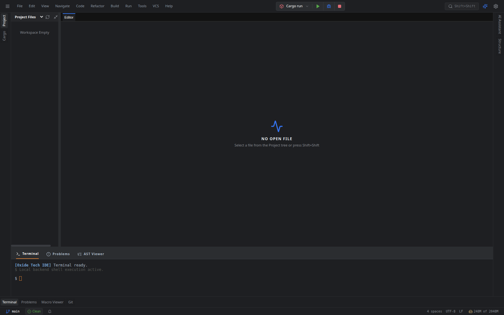
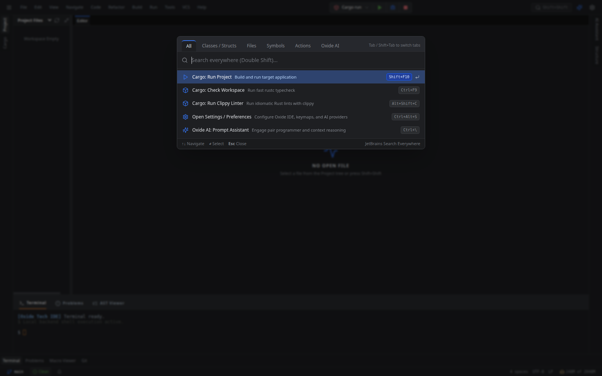
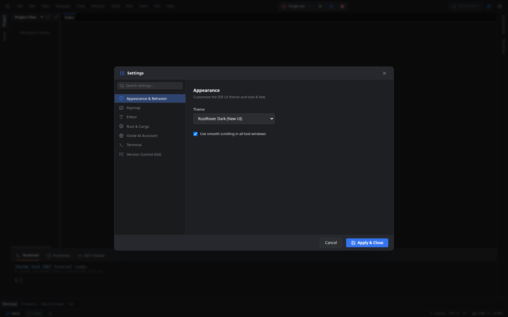

# Oxide Tech IDE 🦀⚡

**Oxide Tech IDE** is an ultra-fast, professional Rust integrated development environment built with **Tauri v2 + React 19 + Rust**, engineered to achieve **1:1 feature and UX parity with JetBrains RustRover (2026.2.2)**.

Featuring a full multi-split docking engine, virtualized file trees, native Cargo workspace analysis, live macro expansion stepper, Monaco RustRover dark theme with inlay hints, git gutter diffs, global Search Everywhere, and a multi-provider Bring-Your-Own-Key (BYOK) AI Copilot.

---

## 📸 Screenshots & UI Showcase

### 1. Main RustRover Spatial Architecture & Docking Shell


* **Top Navigation Bar**: Complete JetBrains New UI top menu hierarchy (`File`, `Edit`, `View`, `Navigate`, `Code`, `Refactor`, `Build`, `Run`, `Tools`, `VCS`, `Help`), Cargo configuration runner widget (`Cargo run`, `Cargo check`, `Cargo clippy`, `Cargo test`, `Cargo bench`), Play (`Shift+F10`), Debug (`Shift+F9`), Stop (`Ctrl+F2`), and Search Everywhere (`Shift+Shift`).
* **Multi-Split Dock Layout**: Powered by `flexlayout-react` with Left, Right, and Bottom tool stripes, customizable docking splits, and layout serialization to `~/.oxide/layout.json`.
* **Status Bar**: Real-time Git branch selector (`main`), linter status indicator (`Clean`), indentation style, UTF-8 encoding, LF line endings, and live memory usage gauge with GC trigger.

---

### 2. Global Search Everywhere (`Double Shift` / `Shift+Shift`)


* **Multi-Category Tabs**: `All` | `Classes / Structs` | `Files` | `Symbols` | `Actions` | `Oxide AI` with fast `Tab` / `Shift+Tab` keyboard cycling.
* **Fuzzy Search Engine**: Powered by `fuse.js` indexing workspace files, crates, struct symbols, and IDE action palettes with instant arrow key navigation and execution.

---

### 3. Comprehensive Settings & Preferences (`Ctrl+Alt+S`)


* **Multi-Category Settings Tree**: `Appearance & Behavior`, `Keymap` (Default IntelliJ, VS Code, Emacs, Sublime), `Editor` (font size, minimap, IdeaVim mode), `Rust & Cargo` (toolchains, inlay hints, on-save clippy/rustfmt), `Oxide AI Assistant` (BYOK multi-provider configurations), `Terminal`, and `Version Control (Git)`.

---

## 🌟 Key Architecture & Features

### 🚀 1. Docking & Tool Window System
* **`Project` Window**: Virtualized file tree powered by `@tanstack/react-virtual` for buttery smooth performance on massive codebases. Features inline **Speed Search** (`Ctrl+F`) and exact JetBrains Darcula Git status colors.
* **`Cargo` Workspace Window**: Interactive package and target hierarchy (`[[bin]]`, `[lib]`, `[[example]]`, `[[test]]`), right-click target runner, quick tasks palette, and `cargo add` modal.
* **`Problems` Window**: Live compiler diagnostics categorized by crate, file, and severity (`Error`, `Warning`, `Info`) with diagnostic code tags (`E0382`, `clippy::needless_borrow`) and double-click editor navigation.
* **`Macro Expansion` Viewer**: Split-screen live `syn`/`quote` AST token stepper to debug and inspect procedural and declarative macros.

### 🎨 2. Editor & Monaco Inlay Hints
* **`rustrover-dark` Theme**: High-fidelity JetBrains Darcula syntax color palette.
* **Monaco Inlay Hints**: Real-time type annotations on `let` bindings (`: Type`), parameter name hints on function calls, and chained method call return types.
* **Left Gutter Layering**: Git VCS modification bars (Green added, Blue modified, Red deleted), click-to-toggle breakpoints (`Shift+F8`), and play glyphs (▶) on `fn main()` and `#[test]` functions.
* **Context Actions (`Alt+Enter`)**: Quick fixes, missing import insertion, and Clippy recommendations.

### 🤖 3. Multi-Provider AI Copilot (BYOK)
* **Universal Model Routing**: Connect seamlessly to Google Gemini, OpenAI, Anthropic Claude, or local Ollama/Llama3 models.
* **Non-Blocking Execution**: Asynchronous Tokio tasks handle background cognitive reasoning without freezing the UI thread.
* **Compiler Self-Healing Guard**: Intercepts compiler diagnostics to suggest and apply surgical one-click fixes.

---

## 🛠️ Technology Stack

| Component | Technology |
| :--- | :--- |
| **Desktop Shell** | Tauri v2 (Rust backend) |
| **Frontend Framework** | React 19 + TypeScript (Strict Mode) |
| **Styling & Icons** | Tailwind CSS v4 + Lucide Icons |
| **Docking Engine** | `flexlayout-react` |
| **Virtualization** | `@tanstack/react-virtual` |
| **Search Engine** | `fuse.js` |
| **Code Editor** | Monaco Editor with custom Monarch Rust tokenizer |
| **State Management** | Zustand (Persisted Storage) |
| **Data Fetching** | TanStack React Query |

---

## ⚡ Getting Started

### Prerequisites
* **Node.js**: v18 or later
* **Rust & Cargo**: Latest stable toolchain
* **pnpm**: Fast package manager

### Installation & Run

1. **Clone the repository and install dependencies**:
   ```bash
   git clone https://github.com/FaezBarghasa/Oxide-Tech-IDE.git
   cd Oxide-Tech-IDE
   pnpm install
   ```

2. **Launch in development mode**:
   ```bash
   pnpm tauri dev
   ```

3. **Build the production release**:
   ```bash
   # Build frontend bundle
   pnpm build

   # Build native Tauri executable
   pnpm tauri build
   ```

---

## ⌨️ Essential Keyboard Shortcuts

| Action | Shortcut |
| :--- | :--- |
| **Search Everywhere** | `Shift+Shift` (Double Shift) |
| **Run Current Configuration** | `Shift+F10` |
| **Debug Current Configuration** | `Shift+F9` |
| **Stop Process** | `Ctrl+F2` |
| **Cargo Check Workspace** | `Ctrl+F9` |
| **Context Actions / Quick Fix** | `Alt+Enter` |
| **Settings / Preferences** | `Ctrl+Alt+S` |
| **Toggle Omnibar** | `Ctrl+K` |
| **Toggle Harpoon Buffers** | `Ctrl+E` |
| **Oxide AI Prompt Assistant** | `Ctrl+\` |

---

## 📄 License

This project is licensed under the MIT License. See [LICENSE](LICENSE) for details.
