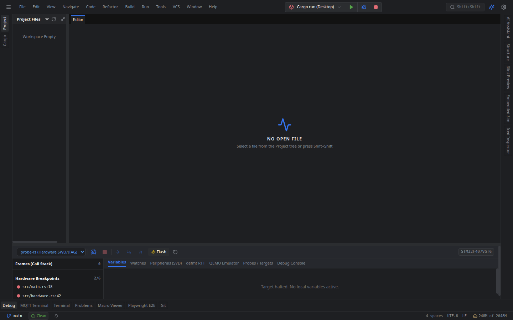
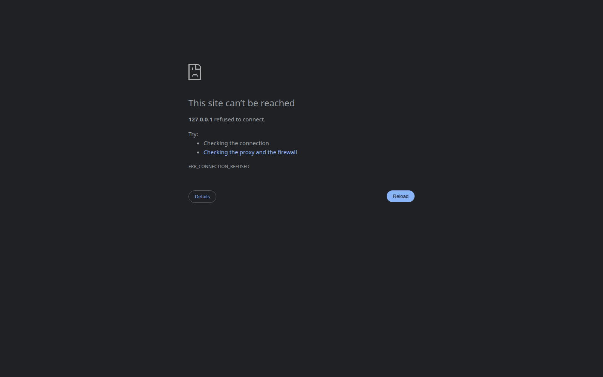

# Oxide Tech IDE 🦀⚡ — Full-Stack Visual Engineering Workstation & JetBrains RustRover Competitor

[](LICENSE)
[](https://www.rust-lang.org/)
[](https://tauri.app/)
[](https://react.dev/)
[](https://www.typescriptlang.org/)

**Oxide Tech IDE** is a high-performance, developer-first integrated development environment built with **Tauri v2 + React 19 + Rust**. Engineered to deliver commercial-grade **1:1 feature and UX parity with JetBrains RustRover / CLion** while serving as an advanced **Full-Stack Visual Engineering Workstation** with native tooling for **Embedded Systems (probe-rs, defmt, QEMU, SVD)**, **Slint UI**, **Embedded Graphics**, **Iced**, and **Playwright E2E**.

---

## 🚀 Key Architectural Pillars & Features

### 1. High-Performance Language Server Protocol (`rust-analyzer`)
- **Persistent JSON-RPC 2.0 Stdio Daemon**: Low-latency background process hosting `rust-analyzer` with asynchronous message streaming.
- **Monaco LSP Integration**: Full support for real-time autocompletion, type hover cards, definition jump, code actions (`Alt+Enter`), and compiler diagnostics.
- **Inlay Hints**: Inline display of parameter names, variable type annotations, and chained method return types.

### 2. Full-Duplex Interactive PTY Terminal
- **Native PTY Backend**: Built on `portable-pty` with asynchronous read/write streams and thread-safe session multiplexing.
- **Multi-Tab Terminal Panel**: Interactive shell (`/bin/bash`) with ANSI color decoding, window resize handling (`xterm-addon-fit`), and raw keystroke routing.

### 3. Native Filesystem Watcher & Local History Engine
- **Debounced `notify` Daemon**: Asynchronously monitors project workspace files and broadcasts changes to refresh the file tree and editor buffers.
- **Append-Only Local History Engine**: Automatically captures granular file revision snapshots on save and edit, allowing developers to inspect revisions and perform one-click rollbacks without Git commits.

### 4. Cargo Test Explorer & Visual Conflict Resolution
- **Test Discovery & Execution**: Discovers workspace tests dynamically via `cargo test -- --list --format=terse` and runs individual or test suites with live stdout/stderr parsing and failure analysis.
- **3-Way Visual Merge Window**: JetBrains-style 3-pane merge tool (Ours, Base, Theirs) with an interactive resolved output editor to quickly resolve merge conflicts.

### 5. Step-by-Step MCU & Hardware Debugger (`Shift+F9`)
- **Multi-Engine Target Debugging**: Integrated support for **`probe-rs`** (CMSIS-DAP / ST-Link / J-Link SWD/JTAG), **`OpenOCD`**, **`QEMU` Cortex-M emulator**, and **`LLDB`**.
- **SVD Peripheral Registers Inspector**: Bitfield tree explorer with live read/write access to MCU registers (`GPIOA`, `RCC`, `USART1`, etc.).
- **`defmt` RTT High-Speed Telemetry**: Microsecond-accurate deferred logging decoded directly from target RAM without semihosting latency.

### 6. Full-Stack Visual Engineering Workstation
- **Slint Declarative Live Preview**: Real-time canvas rendering of `.slint` markup with bi-directional pointer and event forwarding.
- **Embedded Graphics Display Simulator**: Hardware display emulators for SSD1306 (Mono OLED), ST7789 (RGB565 IPS), ILI9341 (TFT), and e-Ink displays with pixel-grid zoom and D-pad input injection.
- **Iced GUI Inspector & Hot Reload**: Live inspection of widget hierarchies and sub-500ms hot reload.
- **Playwright E2E & Visual Regression**: Test explorer and pixel-by-pixel diff comparisons against baseline screenshots.
- **MQTT 5.0 Telemetry Hub**: Real-time pub/sub client supporting wildcard topics (`sensors/#`), QoS 0/1/2, and telemetry templates.

---

## 📸 Screenshots & Visual Tour

### Full-Stack Visual Workstation & Spatial Docking



### Global Search Everywhere (`Double Shift` / `Shift+Shift`)


### Step-by-Step MCU & Hardware Debugger


### MQTT 5.0 Interactive Terminal & Telemetry Hub


---

## 🛠️ Technology Stack

| Layer | Technology |
| :--- | :--- |
| **Desktop Shell** | Tauri v2 (Rust desktop engine) |
| **Language Server** | `rust-analyzer` (JSON-RPC 2.0 stdio daemon) |
| **Terminal Core** | `portable-pty` + `xterm.js` + `xterm-addon-fit` |
| **Filesystem Watcher** | `notify` (Recursive asynchronous change detection) |
| **Frontend Framework** | React 19 + TypeScript (Strict Mode, Zero `any`) |
| **Styling & Layout** | Tailwind CSS + Lucide Icons + `flexlayout-react` |
| **Code Editor** | Monaco Editor with custom Monarch Rust syntax tokenizer |
| **State Management** | Zustand (Local storage persistence) |
| **Data Fetching** | TanStack React Query v5 |

---

## ⚡ Getting Started

### Prerequisites
- **Node.js**: v18 or later
- **Rust & Cargo**: Latest stable toolchain (`rustup default stable`)
- **pnpm**: Fast package manager (`npm i -g pnpm`)
- **rust-analyzer**: Optional host installation or managed daemon

### Installation & Development

1. **Clone the repository and install dependencies**:
   ```bash
   git clone https://github.com/FaezBarghasa/Oxide-Tech-IDE.git
   cd Oxide-Tech-IDE
   pnpm install
   ```

2. **Launch in development mode**:
   ```bash
   pnpm tauri dev
   ```

3. **Verify tests and code style**:
   ```bash
   # Rust workspace tests & strict clippy
   cargo test --workspace --manifest-path src-tauri/Cargo.toml
   cargo clippy --manifest-path src-tauri/Cargo.toml -- -D warnings
   cargo fmt --manifest-path src-tauri/Cargo.toml -- --check

   # Frontend type check & build
   pnpm exec tsc --noEmit
   pnpm run build
   ```

4. **Build release packages (Debian / Linux bundle)**:
   ```bash
   pnpm tauri build
   ```

---

## ⌨️ Essential JetBrains Keyboard Shortcuts

| Action | JetBrains Shortcut | VS Code Equivalent |
| :--- | :--- | :--- |
| **Search Everywhere** | `Shift+Shift` (Double Shift) | `Ctrl+P` |
| **Context Actions / Quick Fix** | `Alt+Enter` | `Ctrl+.` |
| **Run Current Target** | `Shift+F10` | `Ctrl+F5` |
| **Debug Current Target** | `Shift+F9` | `F5` |
| **Cargo Check Workspace** | `Ctrl+F9` | `Ctrl+Shift+B` |
| **Settings / Preferences** | `Ctrl+Alt+S` | `Ctrl+,` |
| **Recent Files (Harpoon)** | `Ctrl+E` | `Ctrl+Tab` |
| **Omnibar Command Palette** | `Ctrl+K` | `Ctrl+Shift+P` |
| **AI Prompt Assistant** | `Ctrl+\` or `Ctrl+L` | `Ctrl+I` |
| **Stop Process** | `Ctrl+F2` | `Shift+F5` |

---

## 📄 License

This project is licensed under the MIT License. See [LICENSE](LICENSE) for details.
