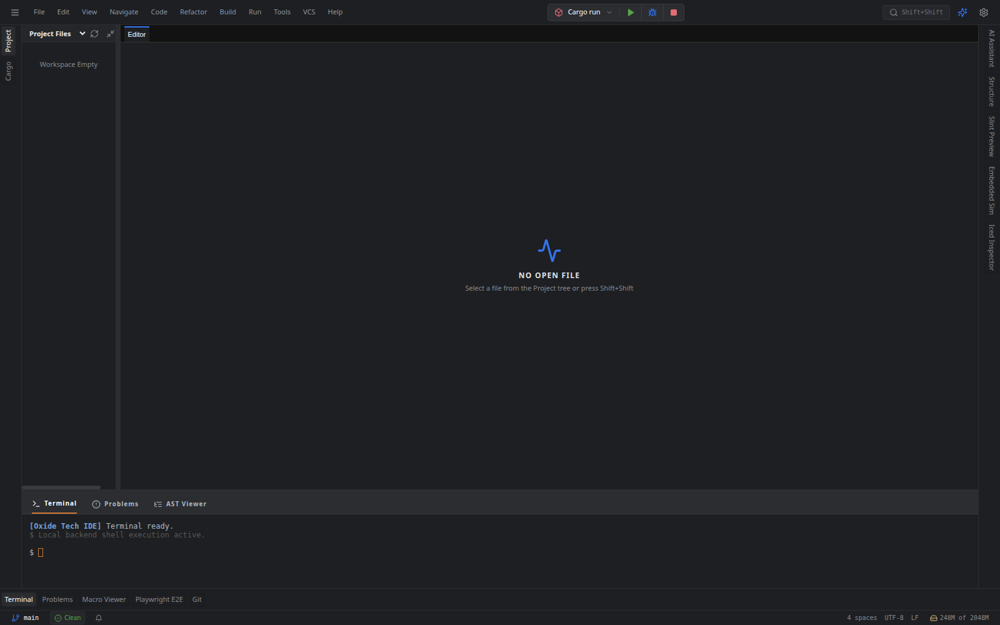

# Oxide Tech IDE 🦀⚡ — Full-Stack Visual Engineering Workstation

**Oxide Tech IDE** is a high-performance, developer-first integrated development environment built with **Tauri v2 + React 19 + Rust**, engineered to achieve **1:1 feature and UX parity with JetBrains RustRover (2026.2.2)** while functioning as a **Full-Stack Visual Engineering Workstation** with native **Playwright**, **Slint**, **Embedded Graphics**, and **Iced** tools.

---

## 📸 Screenshots & UI Showcase

### 1. Full-Stack Visual Workstation & Spatial Docking


* **Top Navigation Bar**: JetBrains New UI top menu hierarchy (`File`, `Edit`, `View`, `Navigate`, `Code`, `Refactor`, `Build`, `Run`, `Tools`, `VCS`, `Help`), unified Run Configuration widget (`Cargo run`, `Cargo check`, `Cargo clippy`, `Cargo test`, `Cargo bench`, `Playwright: Run All E2E`, `Slint: Live Preview`, `Embedded: Hardware Sim`, `Iced: Run with Inspector`), Play (`Shift+F10`), Debug (`Shift+F9`), Stop (`Ctrl+F2`), and Search Everywhere (`Shift+Shift`).
* **Left Tool Stripe**: `Project` file tree and `Cargo` workspace manager.
* **Right Tool Stripe**: `AI Assistant`, `Structure`, `Slint Preview`, `Embedded Sim`, and `Iced Inspector`.
* **Bottom Tool Stripe**: `Terminal`, `Problems` (diagnostics), `Macro Viewer` (live syn expansion), `Playwright E2E`, and `Git` VCS panels.
* **Status Bar**: Real-time Git branch selector (`main`), linter status indicator (`Clean`), indentation style, UTF-8 encoding, LF line endings, and live memory profiling gauge.

---

### 2. Global Search Everywhere (`Double Shift` / `Shift+Shift`)


* **Multi-Category Tabs**: `All` | `Classes / Structs` | `Files` | `Symbols` | `Actions` | `Oxide AI` with fast `Tab` / `Shift+Tab` keyboard cycling.
* **Fuzzy Search Engine**: Powered by `fuse.js` indexing workspace files, crates, struct symbols, and IDE action palettes with instant arrow key navigation and execution.

---

### 3. Comprehensive Settings & Preferences (`Ctrl+Alt+S`)


* **Multi-Category Settings Tree**: `Appearance & Behavior`, `Keymap` (Default IntelliJ, VS Code, Emacs, Sublime), `Editor` (font size, minimap, IdeaVim mode), `Rust & Cargo` (toolchains, inlay hints, on-save clippy/rustfmt), `Oxide AI Assistant` (BYOK multi-provider configurations), `Terminal`, and `Version Control (Git)`.

---

### 4. JetBrains Step-by-Step MCU & Hardware Debugger (`Shift+F9`)


* **Multi-Engine Debugging Core**: Instant switching between **`probe-rs`** (CMSIS-DAP / ST-Link / J-Link SWD/JTAG), **`OpenOCD`** GDB Remote, **`QEMU`** System Emulator, **`defmt RTT`** live telemetry, and **`LLDB`** desktop native targets.
* **Debug Controls Strip**: Resume / Pause (`F9`), Stop (`Ctrl+F2`), Step Over Asm/Line (`F8`), Step Into (`F7`), Step Out (`Shift+F8`), Flash Firmware (`probe-rs run`), and Core Reset (`Ctrl+F5`).
* **SVD Peripheral Registers Inspector**: Real-time bitfield tree explorer with live read/write access to MCU registers (e.g. `GPIOA->MODER`, `GPIOA->ODR`, `RCC->CR`, `USART1`).
* **defmt RTT Real-Time Telemetry**: Microsecond-accurate deferred formatting log stream decoded directly from target RAM buffer without semihosting delays.
* **QEMU System Emulator**: Cortex-M0/M3/M4/RISC-V machine emulator with GDB stub `:1234` and semihosting console integration.
* **Hardware Probes & Target Chip Selector**: Auto-discovery of attached USB probes (voltage, speed, serial) and target chips (`STM32F4`, `STM32H7`, `nRF52840`, `RP2040`, `ESP32-C3`).
* **Active Execution Line Highlight**: Monaco editor yellow glyph arrow and blue paused line indicator.

---

## 🌟 Visual Workstation Subsystems

### 🎭 1. Playwright Web & E2E Testing
* **Test Explorer**: Discovers and runs tests across `.spec.ts` and `.test.ts` files with instant status indicators.
* **Gutter Test Runners**: Green play icons next to test blocks for one-click background execution.
* **Visual Regression Engine**: Pixel-by-pixel diff comparisons against gold standard baselines with automated mismatch highlighting.

### 🎨 2. Slint Declarative Live Preview
* **Interactive `<canvas>`**: High-DPI software rendering pipeline parsing `.slint` markup and drawing live components.
* **Bi-Directional Pointer Bridge**: Click and drag events are forwarded directly to the Slint interpreter state.
* **Property Inspector**: Live controls to inspect and tweak Slint component properties in real-time.

### 📟 3. Embedded Graphics Display Simulator
* **Hardware Display Profiles**: `SSD1306 (128x64 Mono OLED)`, `ST7789 (240x240 RGB565 IPS)`, `ILI9341 (320x240 RGB565 TFT)`, and `Waveshare 2.9" Tri-Color e-Ink`.
* **Pixel Grid Zoom**: Infinite magnification (up to 600%) to inspect pixel placement and font kerning.
* **Hardware Controls & Metrics**: D-Pad hardware button injection, live FPS counters, frame time (ms), and VRAM consumption tracking.

### 🧊 4. Iced Native GUI Inspector & Hot Reload
* **Widget Hierarchy Tree**: Live inspection of `Application` -> `Column` -> `Row` -> `Container` -> `Button` -> `Text`.
* **Computed Layout Box Model**: Visualizes bounding boxes, padding, and spacing constraints.
* **Sub-500ms Hot Reload**: Recompiles and re-renders application state without window flicker.

---

## 🛠️ Technology Stack

| Component | Technology |
| :--- | :--- |
| **Desktop Shell** | Tauri v2 (Rust native backend) |
| **Frontend Framework** | React 19 + TypeScript (Strict Mode) |
| **Styling & Icons** | Tailwind CSS v4 + Lucide Icons |
| **Docking Engine** | `flexlayout-react` |
| **Virtualization** | `@tanstack/react-virtual` |
| **Search Engine** | `fuse.js` |
| **Code Editor** | Monaco Editor with custom Monarch Rust tokenizer |
| **State Management** | Zustand (Persisted Storage) |
| **Data Fetching** | TanStack React Query |

---

## ⚡ Getting Started

### Prerequisites
* **Node.js**: v18 or later
* **Rust & Cargo**: Latest stable toolchain
* **pnpm**: Fast package manager

### Installation & Run

1. **Clone the repository and install dependencies**:
   ```bash
   git clone https://github.com/FaezBarghasa/Oxide-Tech-IDE.git
   cd Oxide-Tech-IDE
   pnpm install
   ```

2. **Launch in development mode**:
   ```bash
   pnpm tauri dev
   ```

3. **Build the production release**:
   ```bash
   # Build frontend bundle
   pnpm build

   # Build native Tauri executable
   pnpm tauri build
   ```

---

## ⌨️ Essential Keyboard Shortcuts

| Action | Shortcut |
| :--- | :--- |
| **Search Everywhere** | `Shift+Shift` (Double Shift) |
| **Run Current Configuration** | `Shift+F10` |
| **Debug Current Configuration** | `Shift+F9` |
| **Stop Process** | `Ctrl+F2` |
| **Cargo Check Workspace** | `Ctrl+F9` |
| **Context Actions / Quick Fix** | `Alt+Enter` |
| **Settings / Preferences** | `Ctrl+Alt+S` |
| **Toggle Omnibar** | `Ctrl+K` |
| **Toggle Harpoon Buffers** | `Ctrl+E` |
| **Oxide AI Prompt Assistant** | `Ctrl+\` |

---

## 📄 License

This project is licensed under the MIT License. See [LICENSE](LICENSE) for details.
