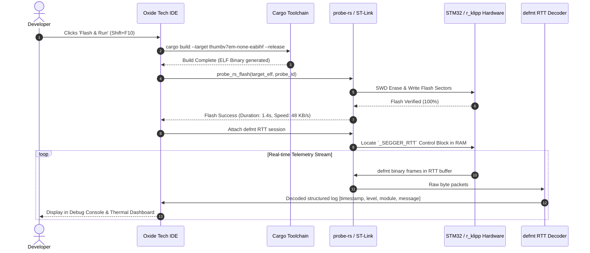
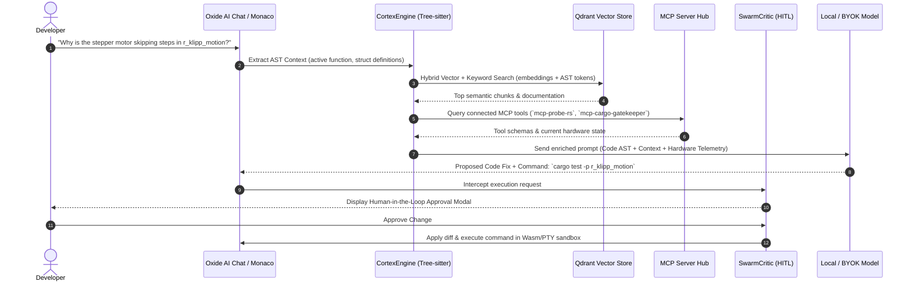
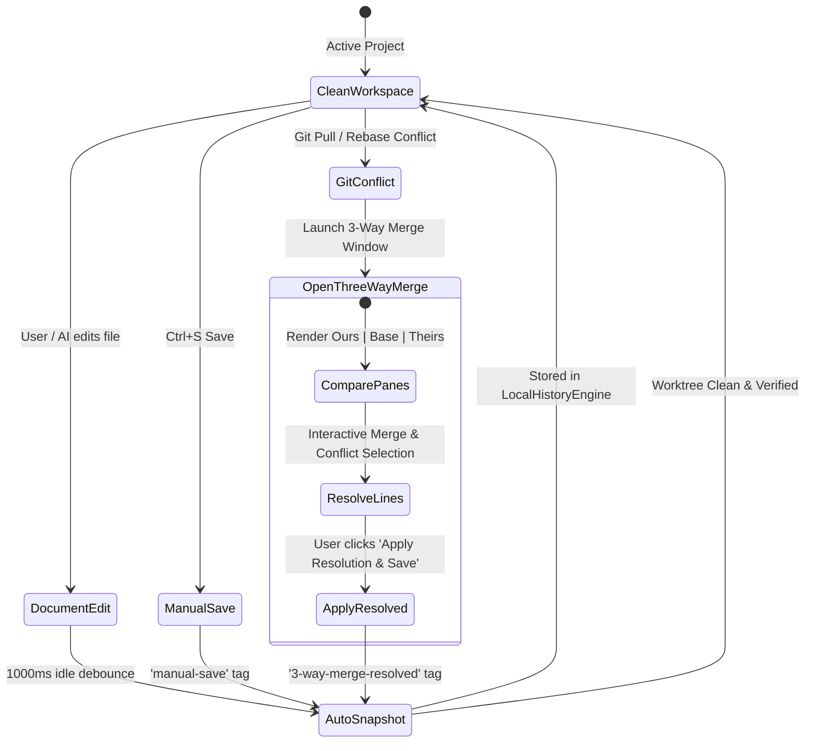

# Oxide Tech IDE — Architecture & Interaction Diagrams

## 1. Complete System Context & Ecosystem Blueprint (C4 Model)

```mermaid
graph TD
    User["👨‍💻 Systems & Embedded Engineer"]

    subgraph OxideIDE ["Oxide Tech IDE (Tauri v2 Workstation)"]
        subgraph Frontend ["React 19 + TypeScript Frontend (Strict Zero-Any)"]
            Monaco["Monaco Editor (Rust Syntax, Inlay Hints, Gutter Diffs)"]
            Dock["FlexLayout Spatial Docking (JetBrains Layout)"]
            Xterm["Xterm.js Interactive PTY Terminal (Multi-Session)"]
            McpUI["MCP Server Hub & HITL Approvals Panel"]
            SvdUI["SVD Peripheral & Register Inspector"]
            KlippUI["r_klipp Thermal & Kinematics Dashboard"]
            ForgeUI["Forge CAD / EDA Preview Canvas"]
        end

        subgraph TauriLayer ["Tauri v2 Native Bridge"]
            LspHandler["lsp_daemon (rust-analyzer JSON-RPC)"]
            PtyHandler["pty_ops (portable-pty daemon)"]
            FsHandler["fs_watcher (notify recursive)"]
            SearchHandler["search_ops (ripgrep streaming & replace)"]
            McuHandler["mcu_debugger_ops (probe-rs / QEMU / defmt)"]
            TestHandler["test_runner_ops (cargo test runner)"]
            ForgeHandler["visual_workstation_ops (Slint / Iced / Forge)"]
        end

        subgraph OxideCore ["oxide_core Crate (Rust Engine)"]
            LocalHistory["LocalHistoryEngine (Append-Only Revisions)"]
            ClaudeBridge["ClaudeBridge & McpServerHub"]
            CortexEngine["CortexEngine (Tree-sitter AST & Local RAG)"]
            SwarmCritic["SwarmCritic & Approval Gatekeeper"]
            WasmSandbox["SandboxEngine (Wasmtime Runtime)"]
            PrivacyFilter["PrivacyGuard (Secret Redaction)"]
        end
    end

    subgraph HostEcosystem ["Host System & Hardware Toolchains (Pop!_OS 24.04)"]
        RA["rust-analyzer (Background Daemon)"]
        Cargo["Cargo / Rustc / Clippy / Rustfmt"]
        Bash["/bin/bash (UNIX PTY Shell)"]
        ProbeRs["probe-rs / OpenOCD (SWD/JTAG)"]
        TargetMCU["Hardware Target (STM32 / Cortex-M / r_klipp)"]
        QemuSys["QEMU (Cortex-M / RISC-V / Redox OS)"]
        LocalVectorDB["Qdrant Vector DB & SurrealDB Graph"]
    end

    User -->|Code Editing & Keymaps| Monaco
    User -->|Spatial Window Layout| Dock
    User -->|Terminal Operations| Xterm
    User -->|Inspect Telemetry| KlippUI
    User -->|Review Agent Actions| McpUI

    Monaco <-->|JSON-RPC via Tauri IPC| LspHandler
    LspHandler <-->|stdio pipes| RA

    Xterm <-->|full-duplex stream| PtyHandler
    PtyHandler <-->|pty master/slave| Bash

    McuHandler <-->|SWD / JTAG link| ProbeRs
    ProbeRs <-->|defmt RTT / SVD Registers| TargetMCU
    McuHandler <-->|GDB stub :1234| QemuSys

    McpUI <--> ClaudeBridge
    ClaudeBridge <--> LocalVectorDB
    CortexEngine <--> LocalVectorDB
    SwarmCritic --> WasmSandbox

    FsHandler -->|fs:change events| Frontend
    TestHandler <-->|cargo test -- --list| Cargo

    TauriLayer --> OxideCore
```

---

## 2. Embedded Build, Flash & `defmt` Telemetry Sequence

---

## 3. AST-Aware Local RAG & Model Context Protocol (MCP) Workflow

---

## 4. 3-Way Merge & Local History Rollback State Diagram

