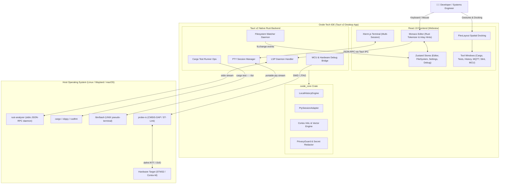
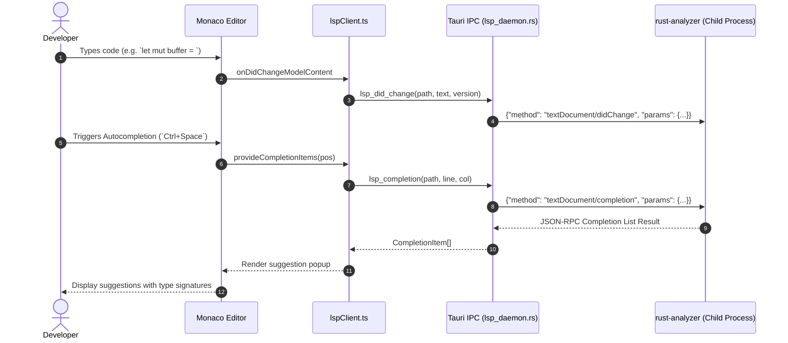
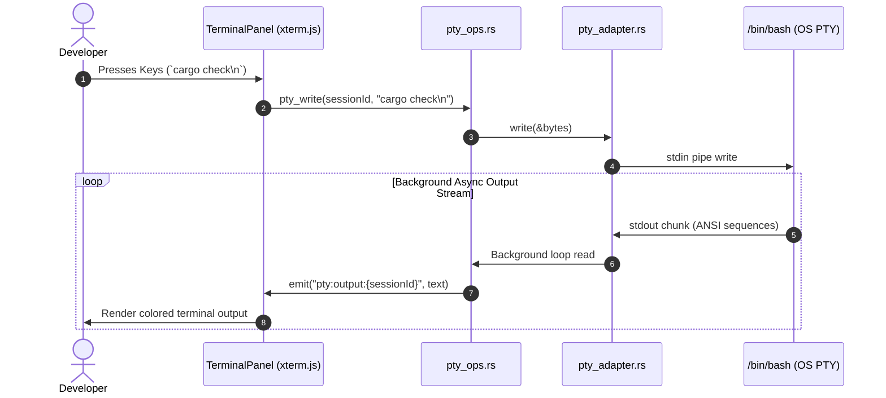
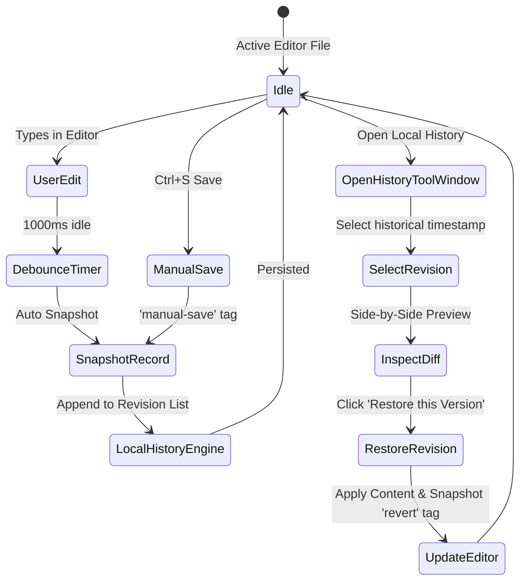

# Oxide Tech IDE — Architecture & Interaction Diagrams

## 1. System Context & Component Architecture (C4 Model)

---

## 2. Language Server Protocol (LSP) Sequence Diagram

---

## 3. PTY Full-Duplex Terminal Streaming Diagram

---

## 4. Local History Snapshot & Rollback Lifecycle

